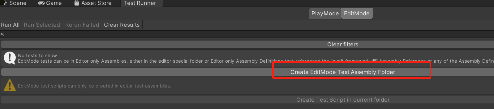
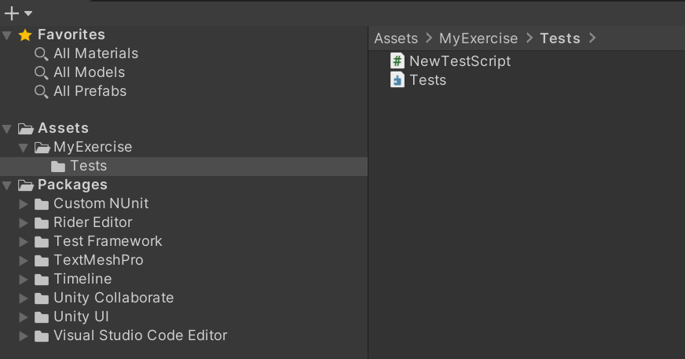
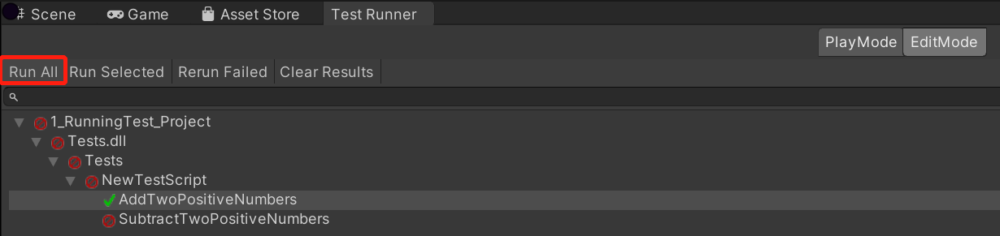

# 1_SimpleUnitTest_Project

## 1. Create Codes Which Will Be Tested
```csharp
public static class MyMath
{
    public static int Add(int a, int b)
    {
        return a + b;
    }

    public static int Subtract(int a, int b)
    {
        return a - b + a; // The code is wrong. Let's see if your test can see that.
    }
}
```

## 2. Create Unit Test 

### 2.1 Open TestRunner
Window->General->Test Runner 


### 2.2 Create Tests
Click `Create EditMode TestAssemblyFolder`, See picture above.


### 2.3 Unit Test Codes
```csharp
using System.Collections;
using System.Collections.Generic;
using NUnit.Framework;
using UnityEngine;
using UnityEngine.TestTools;
using MyExercise;

namespace Tests
{
    public class NewTestScript
    {
        // A Test behaves as an ordinary method
        [Test]
        public void AddTwoPositiveNumbers()
        {
            // Use the Assert class to test conditions
            Assert.AreEqual(1+2, MyMath.Add(1, 2));
        }

        // A UnityTest behaves like a coroutine in Play Mode. In Edit Mode you can use
        // `yield return null;` to skip a frame.
        [UnityTest]
        public IEnumerator SubtractTwoPositiveNumbers()
        {
            // Use the Assert class to test conditions.
            // Use yield to skip a frame.
            yield return null;

            Assert.AreEqual(2-1, MyMath.Subtract(2, 1));
        }
    }
}

```

## 3. Run Unit Test

=======

